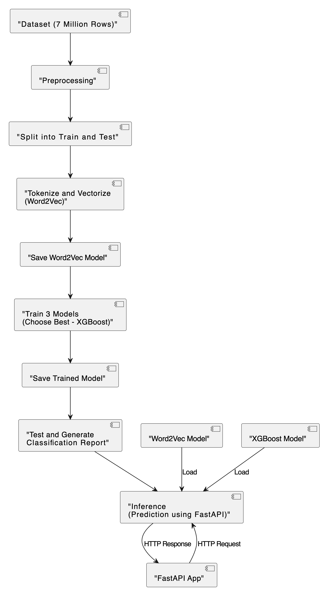
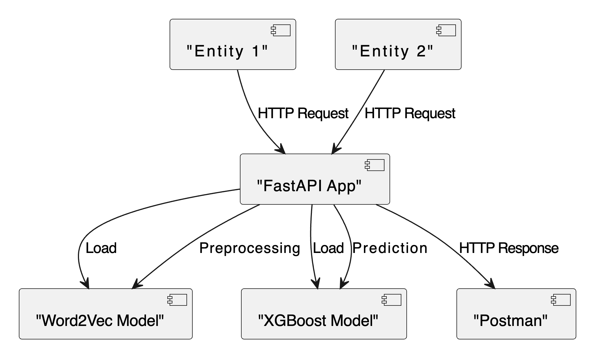

# ds_challenge_alpas

## Training process and componants:


This diagram illustrates the following steps:

- Load and preprocess the dataset.
- Split the dataset into training and testing sets.
Tokenize and vectorize the text data using Word2Vec.
- Save the trained Word2Vec model.
- Train three models and choose the best one (XGBoost in this case).
- Save the trained XGBoost model.
- Test the model and generate a classification report.
- During inference, the FastAPI app loads the Word2Vec and XGBoost models.
- The FastAPI app receives an HTTP request for prediction.
- The FastAPI app performs prediction using the loaded models and sends an HTTP response.

Here is the Daiagram for the FastAPI app chart:



## How to run the code

- Create and activate a virtual environment
- install the requirements.txt file using this command: pip install -r requirements.txt
- Follow these steps to call the FastAPI app from Postman:

  1. **Run the FastAPI App:**
     - Start it using the following command in your terminal:

       ```bash
       uvicorn main:app --reload
       ```

  2. **Open Postman:**
     - Open the Postman application on your computer.

  3. **Create a New Request:**
     - Click on the "New" button in Postman to create a new request.

  4. **Set the Request Type:**
     - Choose the HTTP method for the request. Select "POST" from the dropdown.

  5. **Enter the Request URL:**
     - Enter the URL: `http://127.0.0.1:8000/predict`.

  6. **Add Request Body:**
     - Go to the "Body" tab in Postman. Choose the "raw" option and select "JSON (application/json)" as the data type. Provide the input data in JSON format.
       Example JSON:

       ```json
       {
           "entity_1": "example_entity_1",
           "entity_2": "example_entity_2"
       }
       ```

       Adjust the values of `entity_1` and `entity_2`.

  7. **Send the Request:**
     - Click on the "Send" button to send the POST request to your FastAPI app.

  8. **View the Response:**
     - Postman will display the response from the FastAPI app, including the predicted entity similarity.
